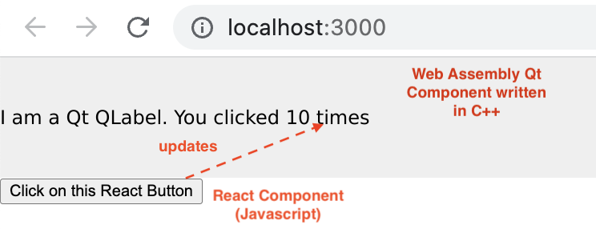

Qt WASM and Next.js integration example
=======================================

This repository contains an example Qt/WASM project embedded in a Next.js application.

### Requirements

* [Qt 6.5.1](https://www.qt.io/)
* [Emscripten SDK 3.1.25](https://emscripten.org/docs/getting_started/downloads.html)

Contents
--------

###  `packages/qt-wasm-component`

A simple Qt Application

#### Build the application for Web Assembly

Begin by installing the Qt WebAssembly kit if you don't have it already. This can be done through your Qt installation's maintenance tool. Select `macos` and `wasm (Single thread)`

Next, install [emscripten](https://emscripten.org) version `3.1.25` ([required for Qt 6.5.1](https://doc.qt.io/qt-6/wasm.html)). It can be installed anywhere on your machine. We recommend installing in your `Code` folder:

    $ cd ~/Code
    $ git clone https://github.com/emscripten-core/emsdk.git
    $ cd emsdk
    $ ./emsdk install 3.1.25
    $ ./emsdk activate 3.1.25
    $ source emsdk.sh

**Set environment variables**

    $ export QTDIR=/path/to/Qt/6.5.1/wasm_singlethread

Check that `$QTDIR` and `$EMSDK` are correctly set before opening VSCode

---

### `packages/app`

The "Next.js" application with the `QtApp` component loading the WASM code.

Run it:

    $ cd packages/app
    $ yarn install
    $ yarn run dev

And open a browser at the specified URL. It works!

